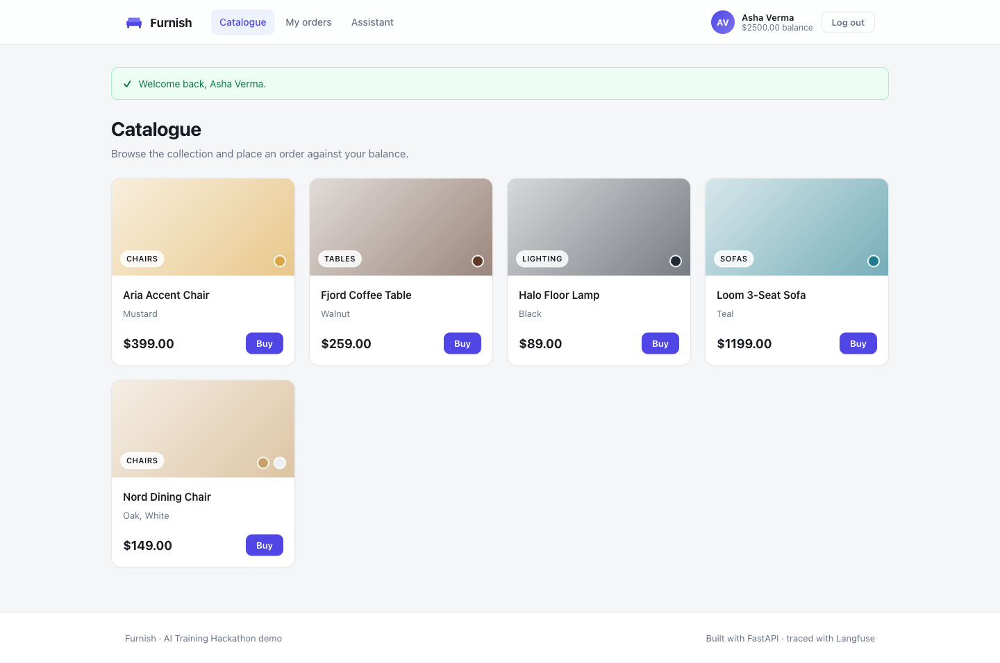

# Furniture Buyer App — AI Training Hackathon, Day 1

A buyer's web app for a furniture shop, built across the event's Day-1 levels:

1. **Level 1** — a normal web app: browse a catalogue, log in, place orders against a
   balance, see your order history.
2. **Level 2** — the same app backed by the shop's real external API (catalogue, balance,
   orders).
3. **Level 3** — an AI agent: type "find me a mustard chair under $500" and it does it.
4. **Level 4** (optional) — a vector-RAG Q&A bot over the catalogue.



It is built with three engineering requirements woven through every step:

- **Version control** — public GitHub repo, one commit + tag per lab step.
- **Observability** — the *development process* is observable via Claude Code telemetry +
  hooks (`.claude/`), and the *running code* is observable via **self-hosted Langfuse**.
- **Test coverage** — a hard **95%** gate enforced in CI, never allowed to regress
  (the suite currently sits at 100%).

## Quick start

```bash
uv sync --all-extras --dev            # install
cp .env.example .env                  # then fill in values
uv run uvicorn app.main:app --reload  # http://localhost:8000
```

## Observability

**Runtime (Langfuse).** Start the local stack and create keys:

```bash
docker compose -f docker-compose.langfuse.yml up -d   # http://localhost:3000
# create a project in the UI, copy keys into .env, set LANGFUSE_ENABLED=true
```

Every model call, tool call, and RAG retrieval is traced through
`app/observability.py`. With `LANGFUSE_ENABLED=false` (the default) all tracing is a
no-op, so dev and tests never make a network call.

**Process (Claude Code).** `source .claude/telemetry.env` before launching Claude Code to
stream dev-session token/cost/tool metrics to an OTEL collector. Hooks in
`.claude/hooks/` block committing secrets and log session boundaries.

## Testing

```bash
uv run pytest              # unit + integration, enforces the 95% gate
uv run pytest -m e2e       # Playwright end-to-end (needs a running server)
uv run pytest -m live      # hits real external services (needs creds)
```

Full test report — inventory, coverage, and page/CLI/Langfuse screenshots — is in
[`docs/TESTING.md`](docs/TESTING.md).

## Deploy
Containerised (`Dockerfile`). Recommended host: **Fly.io** (`fly.toml`, persistent SQLite
volume) with a GitHub Actions workflow that deploys after CI passes. Full options — Fly,
Render, Cloud Run, Codespaces, ngrok, and why GitHub Pages can't host it — are in
`docs/deployment.md`.

```bash
docker build -t furniture-buyer . && docker run -p 8080:8080 -e APP_SECRET_KEY=dev furniture-buyer
```

## Repo map
See `architecture.md` for module responsibilities and diagrams, `requirements.md` for the
acceptance criteria, `docs/PLAN.md` for the full build plan, and `docs/deployment.md` for
hosting.

## Credentials you need to supply
`.env` placeholders you must fill from the organizers / your own accounts: the furniture
API base URL + your `X-Api-Key` + `FURNITURE_USER_ID`, an `ANTHROPIC_API_KEY`, a
`VOYAGE_API_KEY` (RAG), and Langfuse keys. Everything is stubbed behind `app/config.py`
and mocked in tests, so the code runs and stays fully covered without them.
