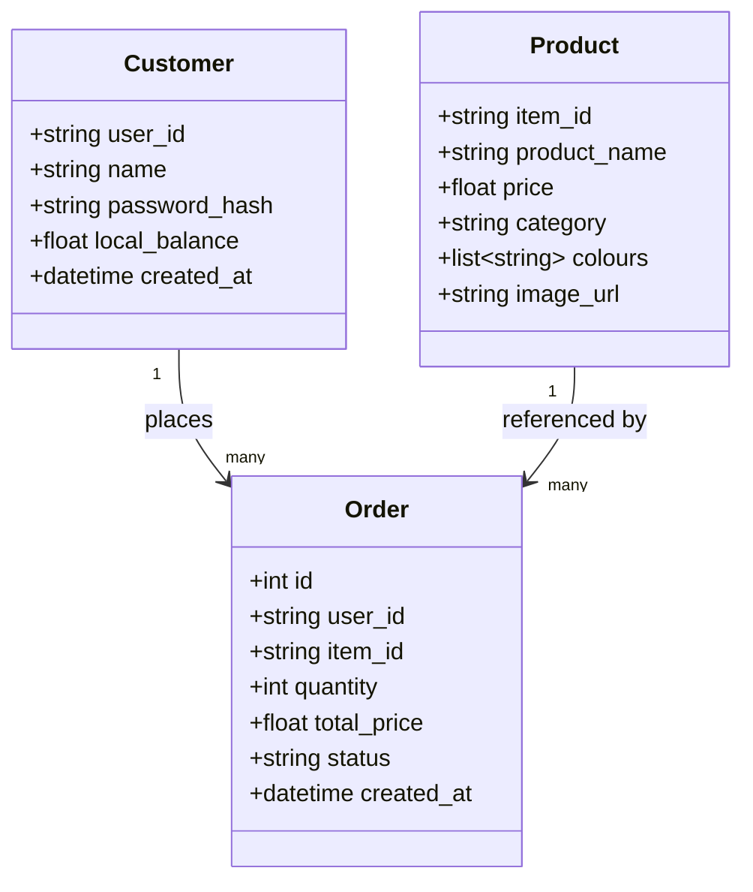
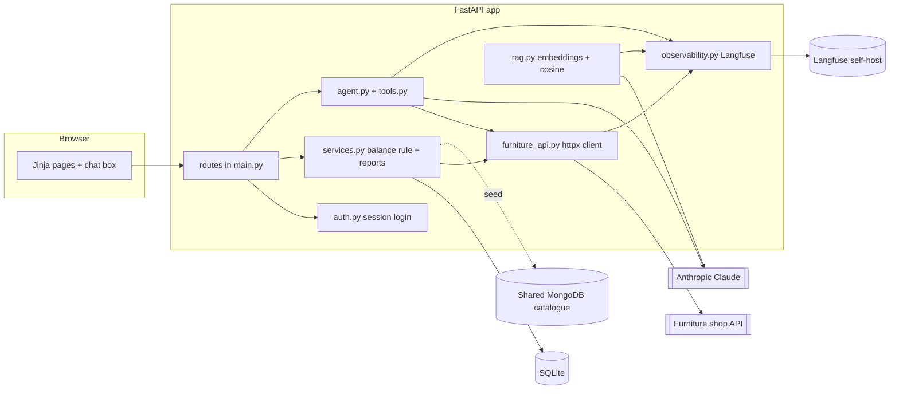

# architecture.md — how the app is built

## Tech stack (and why, in one line each)
- **FastAPI + Jinja2** — small, well-documented Python web framework; server-rendered
  pages keep the front end simple for a one-day build.
- **SQLModel + SQLite** — one library for both the DB schema and the Python models; SQLite
  is a zero-setup file database, perfect for this size.
- **httpx** — modern HTTP client for calling the furniture API (sync + async).
- **Anthropic SDK** — drives the Level 3 agent via Claude tool-use.
- **Langfuse** — one place to see every model call, tool call, latency and cost.
- **pytest + respx + Playwright** — unit, integration (mocked API), and end-to-end tests.

## Entity model

- A **Customer** logs in and has a local balance (Level 1). From Level 2 on, the
  authoritative balance is the external API's; the local one is a fallback for offline dev.
- A **Product** mirrors the catalogue fields (`item_id`, `product_name`, `price`,
  `category`, `colours`, plus `image_url`/dimensions from the shared MongoDB).
- An **Order** links a customer to a product with a quantity and a captured total price.

## Component view

## Module responsibilities
| Module | Responsibility |
|---|---|
| `app/config.py` | Typed settings from env (`pydantic-settings`). |
| `app/db.py` | SQLite engine + session dependency. |
| `app/models.py` | `Customer`, `Product`, `Order` SQLModel tables. |
| `app/auth.py` | Password hashing + session login/logout. |
| `app/services.py` | Balance/workflow rules, order-history reports. |
| `app/furniture_api.py` | Typed client for the external API; maps every error code. |
| `app/catalogue_seed.py` | Load the shared MongoDB catalogue into local `Product`s. |
| `app/tools.py` | The four agent tool definitions + parameter schemas. |
| `app/agent.py` | Claude tool-use loop, confirm-before-spend, error recovery. |
| `app/rag.py` | PDF→chunks→embeddings→cosine retrieval→grounded answer. |
| `app/observability.py` | Langfuse init + span/trace/generation helpers. |
| `app/main.py` | FastAPI app factory + routes + templates. |

## Test strategy
Unit (pure logic: balance rule, tool-schema mapping, cosine similarity) → integration
(API client via `respx`, DB, web via `TestClient`) → e2e (Playwright). Hard 90% gate on
the unit+integration run; e2e/live are separate markers. See `docs/PLAN.md` for the full
per-step test matrix.
