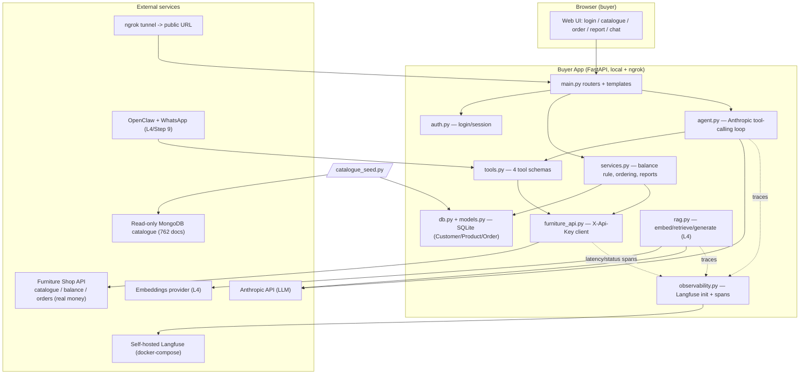
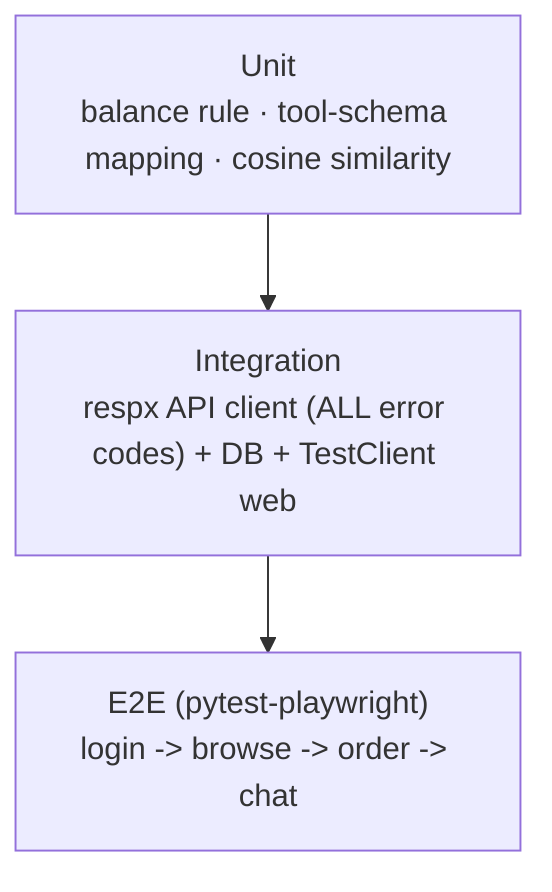

# AI Training Hackathon — Furniture-Shop Buyer App: Engineering Plan

**Event:** AI Training Hackathon, 29–31 Jul 2026, UNSW CBD Campus, Sydney
**Document scope:** Day-1 engineering plan for the buyer web app, covering the event's 9-step lab plus three cross-cutting engineering requirements (Git/GitHub, dual observability, aligned test coverage with a hard 90% gate).
**Status:** Reference document for the team. Decisions marked *fixed* are not up for re-litigation during the build.

---

## 1. Executive Summary + Goal

### 1.1 What we are building

A real furniture shop exposes an online catalogue (**762 products**), a **real per-user event bank balance**, and an order system that **debits that balance for real**. We are building the **buyer's application**:

1. A user logs in.
2. Browses the catalogue.
3. Places orders against a budget (cannot overspend).
4. Sees order history and a spend report.
5. Eventually can type **plain-English requests** that an **agent** fulfils via tool-calling.

We follow the event's **9-step Day-1 lab** end to end (foundations + all 9 steps), building through capability levels:

- **L1** — normal web app (own DB, own login).
- **L2** — call an external API (the shop's real API).
- **L3** — agent with tool-calling over that API.
- **L4** — RAG Q&A over the catalogue (optional).

### 1.2 The three cross-cutting engineering requirements (added by us)

| # | Requirement | Summary |
|---|-------------|---------|
| 1 | **Version control** | Everything in Git, pushed to a public GitHub repo, with per-step commits and tags. |
| 2 | **Observability (dual)** | (a) *Process* observability of the development itself following Claude Code best practices; (b) *Runtime* observability of the running code via **self-hosted Langfuse**. |
| 3 | **Test coverage** | Aligned tests throughout with a **HARD 90% coverage gate**, enforced in CI, from the very first commit, never allowed to regress. |

### 1.3 Goal statement

> Deliver a fully working, fully observed, fully tested furniture-buyer app that satisfies all 9 lab steps, where **every LLM call is traced in Langfuse**, **every development session is observable via Claude Code telemetry and Git history**, and **coverage never drops below 90%** — such that the code is complete and green *even before* organizer/third-party credentials are supplied, because all external dependencies are stubbed behind config and mocked in tests.

### 1.4 Fixed decisions

- **Stack:** Python + **FastAPI** + **SQLModel/SQLite**; **Anthropic Python SDK** for the agent; **Langfuse Python SDK**; **pytest + pytest-cov + respx + pytest-playwright**; managed with **uv**.
- **Langfuse:** self-hosted via **docker-compose** (local).
- **Coverage:** HARD **90%** gate from the start, enforced in CI, ratchet-never-drop.
- **Scope:** foundations + all 9 steps.

---

## 2. Architecture

### 2.1 Proposed repository layout

```
hackathon/
├── app/
│   ├── __init__.py
│   ├── config.py            # pydantic-settings; reads .env; all external deps behind flags
│   ├── db.py                # SQLModel engine/session, create_all, get_session dep
│   ├── models.py            # Customer / Product / Order SQLModel tables
│   ├── auth.py              # login/session; local user auth (L1)
│   ├── observability.py     # single Langfuse init + @observe helpers + span wrappers
│   ├── furniture_api.py     # typed client for the shop API (L2); X-Api-Key header
│   ├── catalogue_seed.py    # optional seed of real products from read-only MongoDB
│   ├── services.py          # domain logic: balance rule, ordering, reports
│   ├── tools.py             # 4 agent tools + honest JSON schemas (L3)
│   ├── agent.py             # Anthropic tool-calling loop, confirm-before-spend (L3)
│   ├── rag.py               # chunk/embed/store/retrieve/generate (L4, optional)
│   ├── main.py              # FastAPI app factory, routers wired
│   ├── templates/           # Jinja2 templates: login, catalogue, order, report, chat
│   └── static/              # css/js assets
├── tests/
│   ├── unit/                # balance rule, tool-schema mapping, cosine similarity
│   ├── integration/         # respx API client (all error codes), DB, TestClient web
│   ├── e2e/                 # pytest-playwright: login -> browse -> order -> chat
│   ├── conftest.py          # fixtures: in-memory DB, fake API, mocked Anthropic/Langfuse
│   └── smoke/               # opt-in live /health smoke test (skipped unless env set)
├── scripts/
│   ├── seed_catalogue.py    # run catalogue_seed against MongoDB
│   └── check_secrets.py     # helper used by pre-commit secret-scan hook
├── docs/
│   ├── PLAN.md              # THIS document
│   ├── requirements.md      # lab doc: what we build + rules
│   └── architecture.md      # lab doc: Mermaid diagrams + component notes
├── .claude/
│   ├── settings.json        # CLAUDE_CODE_ENABLE_TELEMETRY, OTEL_* exporter env
│   ├── hooks/               # secret-scan pre-commit hook, fast-test hook
│   └── commands/            # /commit-step, /add-tests slash commands
├── .github/
│   └── workflows/
│       └── ci.yml           # uv sync, ruff, pytest --cov, fail_under=90
├── CLAUDE.md                # standing rules for Claude Code (lab doc #1)
├── docker-compose.langfuse.yml  # self-hosted Langfuse stack (local)
├── pyproject.toml           # uv project + [tool.pytest]/[tool.coverage] config
├── .gitignore               # .env, .venv, __pycache__, coverage, *.db
├── .env.example             # documented placeholder env (committed)
└── .env                     # real secrets (NEVER committed)
```

> **Lab-doc note:** the event asks for three docs — `CLAUDE.md`, `requirements.md`, `architecture.md`. We keep `CLAUDE.md` at repo root (Claude Code convention). In the as-built repo `requirements.md` and `architecture.md` also live at the **repo root** (not under `docs/`).
>
> **As-built deltas from the layout above** (kept here so the plan stays honest):
> - Tests are **flat** in `tests/` (not split into `unit/ integration/ e2e/`), except `tests/e2e/` which does exist. The `e2e`/`live` split is by pytest **marker**, not directory.
> - The pre-commit secret-scan is `.claude/hooks/guard-commit.sh` (a PreToolUse hook), not `scripts/check_secrets.py`.
> - Added since: `app/llm.py` (shared Anthropic seam), `app/logging_config.py` (structured request logging + rate limiter), `app/shop.py` (unified L1/L2 façade), `app/openclaw.py` (Step 9). Deployment: `Dockerfile`, `fly.toml`, `docs/PRODUCTION_READINESS.md`.

### 2.2 Component diagram



### 2.3 Entity class diagram (Customer / Product / Order)

```mermaid
classDiagram
    class Customer {
        +int id
        +str username
        +str password_hash
        +str external_user_id  "organizer User ID e.g. u001"
        +float remaining_balance  "cached from API /users/{id}"
        +orders() Order[]
    }
    class Product {
        +str item_id
        +str product_name
        +float price
        +str category
        +str colours
        +int colour_count
        +str link
        +float depth
        +float height
        +float width
        +str image_url
        +str image_mime_type
    }
    class Order {
        +str order_id
        +int customer_id
        +str item_id
        +int quantity
        +float total_price
        +str status
        +float remaining_balance_after
        +datetime created_at
    }
    Customer "1" --> "many" Order : places
    Product "1" --> "many" Order : referenced_by
```

> Products are the shop's; the shop is the source of truth for price/availability and balance. We cache a local snapshot for browsing/reporting but always confirm price and debit **through the API** at order time.

---

## 3. Foundation A — Git & GitHub

### 3.1 Repo setup

- **Public** GitHub repo (the lab requires this; it doubles as the Day-1 record). Because it is public, secret hygiene is critical (see hooks in §4).
- `.gitignore` **from the first commit** ignores:

```gitignore
.env
.venv/
__pycache__/
.coverage
coverage.xml
htmlcov/
*.db
```

- Local git identity configured; `.env.example` committed as documented placeholder.

### 3.2 Commit & tag discipline

- **Conventional commits** (`feat:`, `fix:`, `docs:`, `test:`, `chore:`, `ci:`).
- **One commit + one annotated git tag per lab step**: `step-1` … `step-9`. Tags make the Day-1 record navigable and map 1:1 to the lab.
- **Short-lived branches -> PR -> merge**: each step done on `step/N-slug`, opened as a PR, merged after CI passes.

### 3.3 Protection & CI gate

- **Branch protection** on `main`: no direct pushes, PR required, **CI must pass** (lint + tests + 90% coverage) before merge.
- CI failures block the merge — the 90% gate is not advisory.

---

## 4. Foundation B — Process Observability (Claude Code best practices)

Goal: **observe the whole development process**, not just the running code. Three mechanisms.

### 4.1 Standing rules in `CLAUDE.md`

`CLAUDE.md` encodes the rules Claude Code must always follow, so every session behaves consistently:

- **Commit style:** conventional commits; one commit + tag per step.
- **Never touch `.env`:** it is git-ignored and must never appear in `git status` staged.
- **Every new LLM call must be Langfuse-traced:** no un-observed model calls may be added.
- **Tests + coverage must pass before any commit:** 90% gate is a precondition, not a follow-up.
- **Plan before build:** describe the goal / write the plan before writing code (mirrors Step 0's describe-the-goal workflow).

These rules make the *intent* of each session legible and auditable — the first pillar of process observability.

### 4.2 Living design docs

- **`docs/requirements.md`** — what we build and the workflow rules (balance rule, exact-match search, confirm-before-spend, error handling).
- **`docs/architecture.md`** — the Mermaid component + entity class diagrams (also in §2 here), updated as the design evolves.

Keeping these in-repo and updated per step means the design decisions are observable in Git history alongside the code.

### 4.3 Claude Code OpenTelemetry (dev-session metrics)

Enable Claude Code's built-in telemetry so each development session emits **token usage, cost, and tool-call metrics**:

- `CLAUDE_CODE_ENABLE_TELEMETRY=1`
- `OTEL_*` exporter env (endpoint/protocol/headers) pointing at our collector/backend.

This captures the *cost and shape* of the development process itself — how many tokens/tools each step consumed — completing the "observe the whole process" picture.

### 4.4 Hooks (enforcement, not trust)

Configured under `.claude/hooks/` and mirrored as git pre-commit-style checks:

| Hook | Trigger | Action | Maps to |
|------|---------|--------|---------|
| **Secret-scan** | before commit | Scans staged diff for `.env`, API keys, MongoDB URIs; **blocks** commit if found | Protects the public repo; enforces "never touch .env" |
| **Fast-test** | before commit | Runs the fast unit/integration suite | Enforces "tests pass before commit" |

Hooks make the standing rules **mechanically enforced** rather than relying on discipline.

### 4.5 Custom slash commands

Under `.claude/commands/`:

- **`/commit-step`** — runs fast tests, verifies `.env` not staged, creates the conventional commit + annotated `step-N` tag, pushes.
- **`/add-tests`** — generates aligned tests for the code just written and checks coverage stays ≥ 90%.

These encode the repeatable process so every step is executed identically and observably.

---

## 5. Foundation C — Runtime Observability (Langfuse) + Coverage

### 5.1 Self-hosted Langfuse

- Brought up locally via **`docker-compose.langfuse.yml`** (Langfuse + Postgres + Clickhouse + Redis + MinIO per the stock self-host compose).
- A **single init** in `app/observability.py` reads `LANGFUSE_HOST`, `LANGFUSE_PUBLIC_KEY`, `LANGFUSE_SECRET_KEY` from env. If keys are absent, tracing degrades to a no-op so the app still runs and tests still pass.

### 5.2 Tracing model

- **`@observe` decorator** on high-level entry points.
- **Generation spans** for every Anthropic call (model, prompt, tokens, latency).
- **Tool spans** for each of the 4 tool invocations inside the agent loop.
- **Retrieval spans** for RAG (query, top-k, scores).
- **Where used per step:**
  - **Step 5:** lightweight outbound-API **latency/status spans** around `furniture_api.py` calls.
  - **Step 6:** **one trace per chat request**, nesting generation + tool spans.
  - **Step 8:** **retrieval spans** around embed/cosine/retrieve, plus the final generation span.

Rule (from CLAUDE.md): **no LLM call ships without a span.**

### 5.3 Coverage strategy

- **pytest + pytest-cov**, with `fail_under = 90` in `pyproject.toml` `[tool.coverage.report]`.
- **Test pyramid:**



| Layer | Covers |
|-------|--------|
| **Unit** | Balance workflow rule; tool JSON-schema mapping; cosine similarity for RAG |
| **Integration** | `furniture_api.py` with **respx** exercising every error code (401/403/404/402/429 + happy path); DB CRUD; web routes via FastAPI `TestClient` |
| **E2E** | Playwright flow: login -> browse catalogue -> place order -> chat with agent |
| **Smoke (opt-in)** | Live `GET /health` against the real API; **skipped** unless `SHOP_API_BASE_URL` set |

- **CI gate:** `pytest --cov=app --cov-fail-under=90` runs in `.github/workflows/ci.yml`.
- **Ratchet-never-drop:** coverage may rise but a step that drops below 90% fails CI and cannot merge.

---

## 6. Per-Step Execution Plan (Steps 1–9)

> **Note on external dependencies:** the code is written so that everything the organizers/third parties provide at runtime is **behind `config.py` flags** and **mocked in tests**. This means each step is fully implemented and stays ≥ 90% covered even without live credentials. Dependencies we cannot satisfy without action: **organizer API base URL + API key**, **Anthropic API key**, **an embeddings provider key**, **ngrok account**, **OpenClaw + a real WhatsApp number**. Each is stubbed (see §7 checklist).

### Step 0 — Orientation (no code)

Describe-the-goal workflow with Claude Code; internalise levels **L1–L4** and the glossary (repo, API, endpoint, key, JSON, DB, localhost, agent, tool-calling, prompt). Feeds §4.1 CLAUDE.md and §2 architecture. No commit of its own beyond scaffolding.

### Step 1 — Repo & project files

| Aspect | Detail |
|--------|--------|
| **Build** | Create public GitHub repo, clone, open in VS Code, set git identity. Author `CLAUDE.md`, `docs/requirements.md`, `docs/architecture.md`. Scaffold `pyproject.toml` (uv), `.gitignore`, `.env.example`. |
| **Git checkpoint** | `chore: scaffold repo, docs, and tooling` — tag **`step-1`** |
| **Observability** | Enable Claude Code telemetry env (§4.3); commit hooks + slash commands (§4.4–4.5); CLAUDE.md standing rules established. |
| **Tests** | CI skeleton (`ci.yml`) with `--cov-fail-under=90` active from day one; a trivial `test_import` keeps the suite green. |
| **External deps** | GitHub account (participant). |

### Step 2 — Build first app (L1)

| Aspect | Detail |
|--------|--------|
| **Build** | `models.py` (Customer/Product/Order) + Mermaid class diagram in `architecture.md`; `db.py` SQLite; `auth.py` login; web UI (catalogue/order/report); **workflow rule: cannot order above remaining balance, with a clear message**; report page (past orders + total spent). Optional: `catalogue_seed.py` seeds real products from the read-only **MongoDB** (`catalog` db, `catalog` collection, 762 docs; fields `item_id, product_name, price, category, colours, colour_count, link, depth, height, width, image_url, image_mime_type`). Reachable via **ngrok**. |
| **Git checkpoint** | `feat: L1 buyer web app with balance rule and report` — tag **`step-2`** |
| **Observability** | Structured request logging; hooks placeholders for later spans. (No LLM yet.) |
| **Tests** | *Unit:* balance rule (allow at/under, reject over, message text). *Integration:* DB CRUD; web routes via TestClient (login, catalogue render, order happy path + over-balance rejection, report totals). MongoDB seed mocked. |
| **External deps** | MongoDB URI (provided in brief — read-only), ngrok account. Seed mocked in tests. |

### Step 3 — Get & understand the API (L2, comprehension)

| Aspect | Detail |
|--------|--------|
| **Build** | Receive **User ID** (e.g. `u001`) + **API key** from organizers. Understand the four actions: browse catalogue (public), look up one product, check balance (auth), place order (auth). Internalise rules: **exact case-insensitive category match** (no fuzzy — price/colour/vibe reasoning lives in app/agent); **don't fetch images while browsing**; key tied to one `user_id`; `POST /orders` spends **real** balance. Error codes: **401** missing/bad key, **403** valid key wrong user, **404** unknown id, **402** insufficient balance, **429** rate limited (obey `Retry-After`). |
| **Git checkpoint** | `docs: document shop API contract and error codes` — tag **`step-3`** |
| **Observability** | Document which calls will get spans in Step 5. |
| **Tests** | Encode the error-code contract as test expectations/fixtures reused by Step 5 (respx handlers per code). |
| **External deps** | Organizer API base URL + key + User ID. Absent -> `config.py` leaves them unset; tests use fixtures. |

### Step 4 — API reference (participant guide, comprehension)

| Aspect | Detail |
|--------|--------|
| **Build** | Codify the reference in `furniture_api.py` design. Base URL from organizer; header **`X-Api-Key`**. Endpoints: `GET /health` (no auth); `GET /catalogue/categories`; **`GET /catalogue/search-index?category=&limit=&skip=`** (use for browsing, no images); `GET /catalogue/{item_id}` (full detail incl base64 image, slow — only for a specific item); `GET /catalogue/{item_id}/image` (raw bytes); `GET /catalogue` (**AVOID** — embeds all images base64, 20+s, strict rate limit); `GET /users/{user_id}` (balance, auth, own only); `POST /orders` body `{user_id,item_id,quantity}` -> `{order_id,status,total_price,remaining_balance}`; `GET /orders/{user_id}` (history); `GET /orders/{order_id}/invoice` (PDF bytes). **Off-limits/organizer-only:** raw ledger, others' balances/orders, all-participants view, built-in shopping-assistant chat endpoint. Read-only MongoDB catalogue as in Step 2. **Agent wiring guidance:** honest descriptions re exact-match limit; keep base64 images out of model context; agent acts as one user only; confirm before spending; recover from 402/404 gracefully. |
| **Git checkpoint** | `feat: typed furniture_api client (search-index, users, orders)` — tag **`step-4`** |
| **Observability** | Define the outbound span wrapper signature (latency + status) for reuse. |
| **Tests** | *Integration (respx):* each endpoint's happy path + every error code (401/403/404/402/429 with `Retry-After`); assert we call **search-index** (not `/catalogue`) for browsing and never fetch images during browse. |
| **External deps** | Organizer base URL/key (mocked via respx). |

### Step 5 — Connect app to API

| Aspect | Detail |
|--------|--------|
| **Build** | Put key in `.env`; ensure `.env` in `.gitignore`; **verify `git status` never shows `.env`**. Replace placeholder catalogue with real **search-index** data; show **real balance** from `/users/{id}`; wire **real ordering** (`POST /orders`) with **confirmation + updated balance**; graceful error handling (insufficient-balance message, item-no-longer-available message, no crashes). **Adversarial testing:** overspend, nonexistent product, double-click buy. |
| **Git checkpoint** | `feat: wire app to live shop API with error handling` — tag **`step-5`** |
| **Observability** | **Lightweight outbound-API latency/status spans** around every `furniture_api.py` call (§5.2). |
| **Tests** | *Integration:* search-index feeds catalogue view; balance display; order flow updates balance; 402 -> friendly message; 404 -> item-unavailable message; double-submit idempotency/guard; assert spans emitted (Langfuse client mocked). |
| **External deps** | Organizer base URL/key (live for demo; mocked in tests). |

### Step 6 — Build agent (L3)

| Aspect | Detail |
|--------|--------|
| **Build** | Text box for **plain-English requests**. Four tools in `tools.py` (search catalogue, look up one product, check balance, place order) with **good names + honest descriptions** (state the exact-match limit). Agent (`agent.py`, Anthropic SDK) applies its **own reasoning** for "cheap"/colour over plain results. **Confirm-before-spend** before `POST /orders`. **Graceful conversational failure** for 402/404. Test multiple phrasings incl **"buy the first one"** (context memory) and intentional failures. |
| **Git checkpoint** | `feat: L3 agent with tool-calling and confirm-before-spend` — tag **`step-6`** |
| **Observability** | **One Langfuse trace per chat request**, nesting a generation span per model call and a tool span per tool invocation. |
| **Tests** | *Unit:* tool-schema mapping (names/params/descriptions match `furniture_api`). *Integration:* mocked Anthropic tool-use turns — search -> reason "cheapest blue" -> confirm -> order; "buy the first one" uses prior context; 402/404 produce graceful replies; assert confirm-before-spend gate; assert trace/spans created. |
| **External deps** | Anthropic API key (mocked in tests), organizer API (mocked). |

### Step 7 — Showcase checklist

| Aspect | Detail |
|--------|--------|
| **Build** | End-to-end smoke on the public **ngrok** URL: fresh open, login, real catalogue, real balance, plain-English request, confirmed purchase updates balance, an intentional failure handled, tunnel + app still running. Demo narrative: problem in one sentence, show-don't-tell, one honest limitation. Self-check table per level (L1–L4). |
| **Git checkpoint** | `docs: showcase checklist and demo narrative` — tag **`step-7`** |
| **Observability** | Confirm traces appear in Langfuse during the smoke run; Git commit history *is* the Day-1 record. |
| **Tests** | *E2E (Playwright):* full login -> browse -> order -> chat against a local test server + mocked API; opt-in live `/health` smoke (skipped without env). |
| **External deps** | ngrok, organizer API, Anthropic (live for demo; E2E uses mocks). |

### Step 8 — Vector RAG (L4, optional)

| Aspect | Detail |
|--------|--------|
| **Build** | Answer open-ended catalogue questions (e.g. "most affordable option in blue?"). `rag.py`: **chunk** (per product), **embed** (Anthropic does **not** embed — use a recommended embeddings model/provider), **store** (in-memory fine for 762), **retrieve** by **cosine similarity**, **generate** with retrieved context. Source: a public **product-catalogue PDF**. Hints: extract PDF text first; chunk per product; keep structured fields attached; **test retrieval before wiring generation**. |
| **Git checkpoint** | `feat: L4 vector RAG over product catalogue` — tag **`step-8`** |
| **Observability** | **Retrieval spans** (query, top-k, scores) + final generation span. |
| **Tests** | *Unit:* cosine similarity; per-product chunking keeps fields attached. *Integration:* retrieval returns expected product for a seeded query **before** generation; generation uses retrieved context (embeddings + Anthropic mocked). |
| **External deps** | Embeddings provider key (mocked), catalogue PDF, Anthropic (mocked). |

### Step 9 — Connect OpenClaw (optional)

| Aspect | Detail |
|--------|--------|
| **Build** | OpenClaw is a separate open-source personal AI agent on the laptop, acting through **WhatsApp** via a skill system. Install it, connect WhatsApp, **package the same 4 Step-6 tools as an OpenClaw skill with the same descriptions**, test via a real WhatsApp message. **Safety:** OpenClaw is **not sandboxed** — grant it **only this one skill**. |
| **Git checkpoint** | `feat: expose buyer tools as an OpenClaw skill` — tag **`step-9`** |
| **Observability** | Tool spans still emitted (skill calls the same traced `tools.py` path). |
| **Tests** | *Unit/Integration:* the OpenClaw skill adapter maps to the same 4 tool schemas/descriptions and dispatches to the same functions (adapter tested in isolation; WhatsApp/OpenClaw runtime mocked). |
| **External deps** | OpenClaw install + a real WhatsApp number (manual; adapter fully unit-tested without them). |

---

## 7. Risks & Mitigations + Credentials/Action Checklist

### 7.1 Risks & mitigations

| Risk | Impact | Mitigation |
|------|--------|-----------|
| Real orders spend **real** event balance | Accidental/duplicate spend | Hard balance rule (§Step 2); **confirm-before-spend** (§Step 6); double-click guard (§Step 5); orders only via API. |
| `.env` leaked to **public** repo | Key exposure | `.gitignore` from commit 1; **secret-scan pre-commit hook**; `git status` check in `/commit-step`. |
| `429` rate limiting | Broken demo | Obey `Retry-After`; use **search-index** not `/catalogue`; never fetch images while browsing. |
| Slow endpoints (`/catalogue`, per-item detail) | 20+s latency | Avoid `/catalogue`; browse via search-index; fetch full detail/image only for a specific item. |
| Exact-match-only category search | Poor UX if treated as fuzzy | Reasoning (price/colour/vibe) lives in app/agent; tool descriptions state the limit honestly. |
| Missing credentials at build time | Can't run live | Everything behind `config.py` flags + mocked in tests; app runs (traces no-op) and stays ≥ 90% covered without them. |
| Coverage regression | CI red / merge blocked | Hard `--cov-fail-under=90`, ratchet-never-drop, fast-test hook before commit. |
| OpenClaw not sandboxed | Over-broad laptop access | Grant only the single buyer skill. |
| Langfuse stack heavy locally | Docker resource use | Self-host compose only when demoing; no-op tracing otherwise. |

### 7.2 What needs the participant's credentials/action

| Item | Needed for | Provided by | Stub / fallback |
|------|-----------|-------------|-----------------|
| **GitHub account + public repo** | Steps 1–9 | Participant | — (required) |
| **Organizer API base URL + API key + User ID** | Steps 3–7 | Organizers | `config.py` unset -> respx mocks in tests |
| **Anthropic API key** | Steps 6, 8 | Participant | Mocked SDK responses in tests |
| **Embeddings provider key** | Step 8 | Participant | Mocked embeddings in tests |
| **ngrok account** | Steps 2, 7 | Participant | Local `127.0.0.1` for dev/tests |
| **MongoDB catalogue URI** | Step 2 (seed) | Provided in brief (read-only) | Seed mocked in tests |
| **OpenClaw install + WhatsApp number** | Step 9 | Participant | Adapter unit-tested; runtime mocked |
| **Docker (Langfuse)** | Runtime observability | Participant | No-op tracing when Langfuse env absent |
| **Claude Code telemetry backend (OTEL endpoint)** | Process observability | Participant | Telemetry env optional; local collector or disabled |

---

*End of plan. This document should be updated in-repo as steps complete; its Git history is part of the Day-1 record.*
