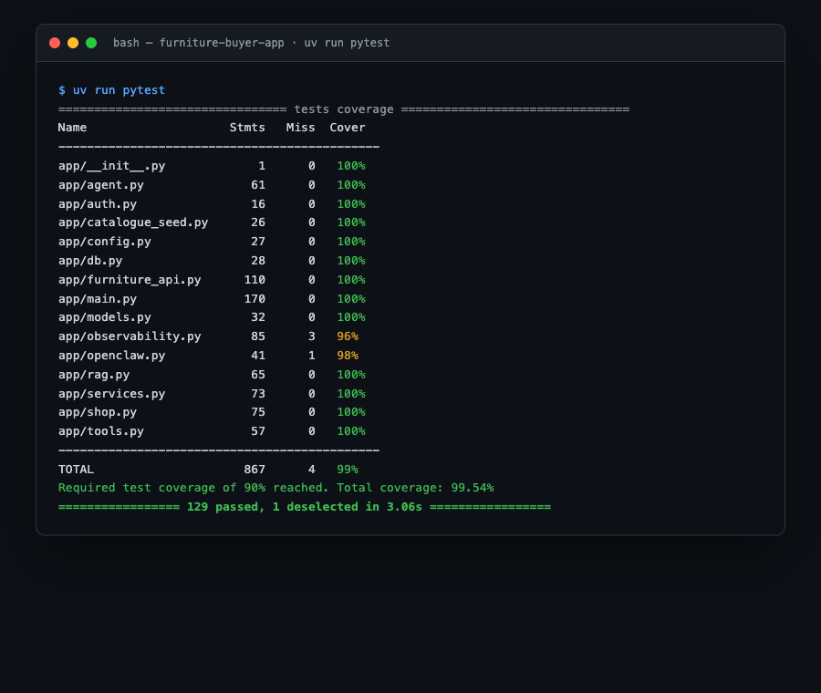
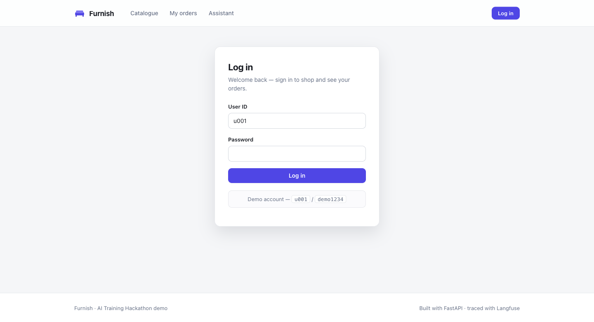
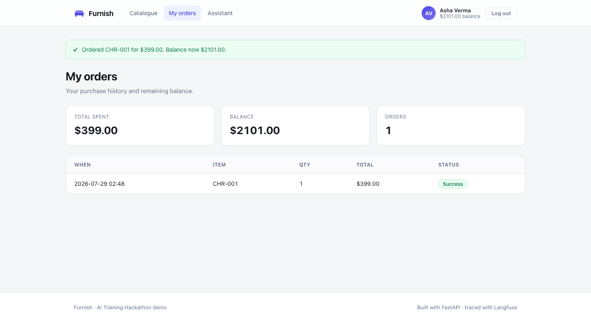
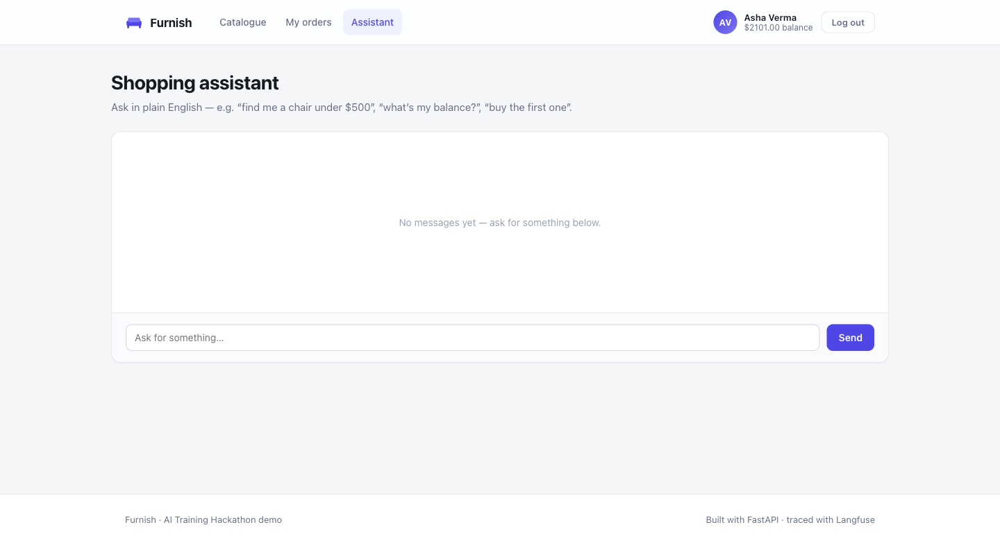
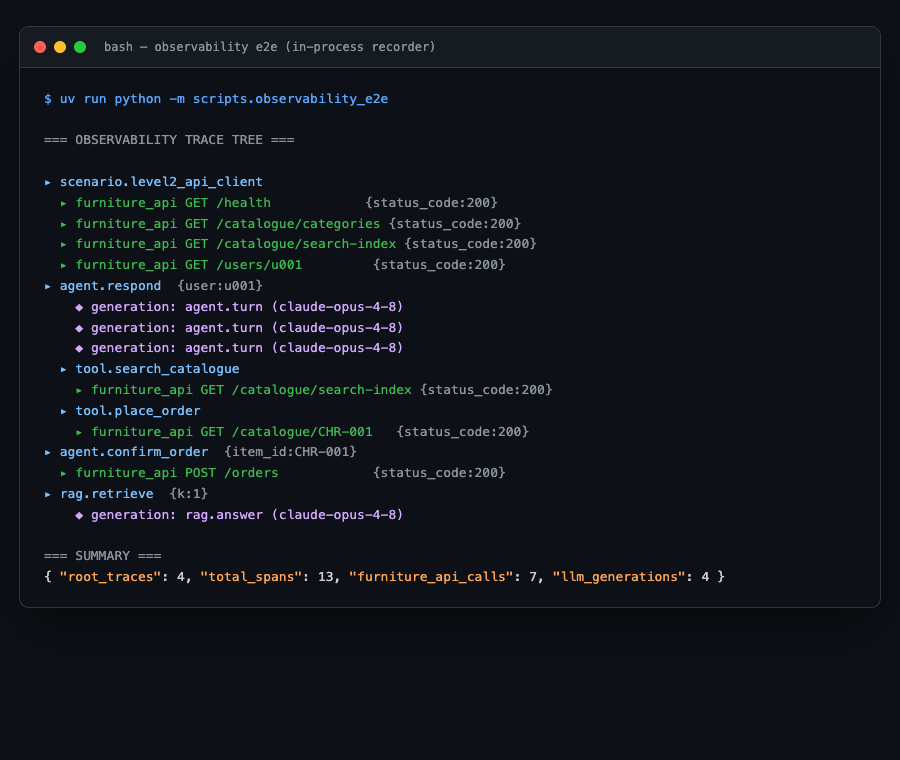
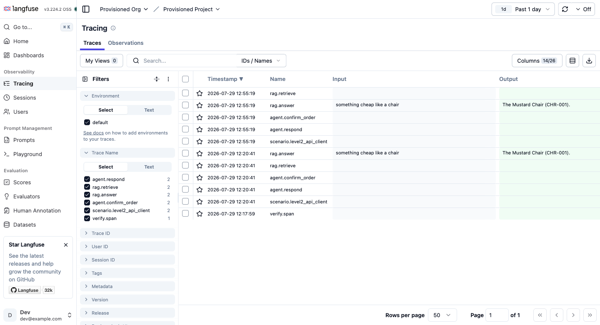
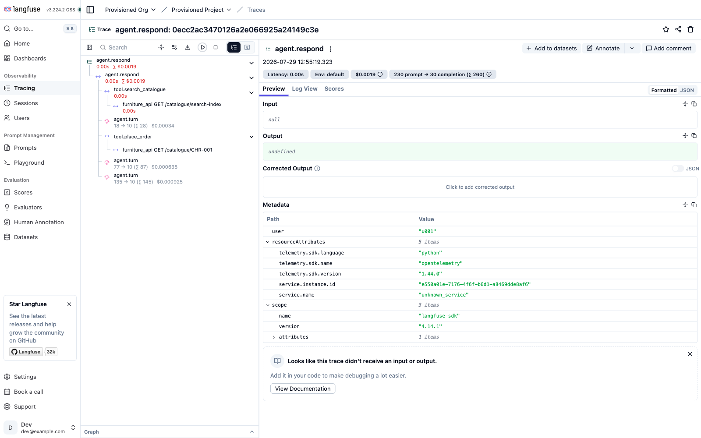

# Test Report

Complete test documentation for the furniture-buyer app: the full test inventory, how
each layer runs, and screenshots of the **application pages**, the **CLI runs**, and the
**Langfuse traceability** produced by the tests.

- **130 tests** total — **129** unit/integration (the gated suite) + **1** Playwright e2e.
- **99.54%** line coverage, enforced by a **hard 90% gate** (`--cov-fail-under=90`) in CI.
- No test touches a real external service: the furniture API is mocked with `respx`, the
  LLM/embedder are scripted fakes, and Langfuse is a no-op unless explicitly enabled.

## How to run

```bash
uv run pytest                 # 129 unit + integration, enforces the 90% gate
uv run pytest -m e2e          # Playwright browser flow (needs `playwright install chromium`)
uv run pytest -m live         # optional: hit real services (needs credentials)
uv run python -m scripts.observability_e2e   # traced end-to-end run → trace tree + JSON
```

---

## 1. Test inventory

| Test file | Tests | Layer | What it verifies |
|---|--:|---|---|
| `test_config.py` | 4 | unit | Settings load from env, `is_sqlite`, cached singleton, Langfuse off by default |
| `test_db.py` | 4 | unit | Engine caching/reset, table creation, session dependency, persistence |
| `test_models.py` | 4 | unit | `Customer`/`Product`/`Order` defaults, colour JSON round-trip |
| `test_auth.py` | 4 | unit | Password hash/verify, empty-hash guard, session login/logout |
| `test_services.py` | 9 | unit | User create/auth, catalogue filter, **balance rule**, order history, total spent, bootstrap |
| `test_catalogue_seed.py` | 3 | unit | MongoDB doc→Product mapping, projection/limit, idempotent seeding |
| `test_furniture_api.py` | 16 | integration | Every endpoint + **all error codes** (401/402/403/404/429), auth headers, image field ignored |
| `test_shop.py` | 13 | integration | Unified local + real-API paths, friendly error mapping, product view |
| `test_tools.py` | 9 | unit | The 4 agent tools, client-side price/colour filtering, **place_order returns pending (no spend)** |
| `test_agent.py` | 7 | unit | Tool-use loop, text/tool turns, **confirm-before-spend**, max-step guard, LLM factory |
| `test_rag.py` | 8 | unit | Chunking, cosine retrieval, grounded answer + cited sources, factories |
| `test_openclaw.py` | 7 | integration | Skill manifest, `handle`/`confirm_order`, confirm-before-spend preserved |
| `test_observability.py` | 16 | unit | No-op path, legacy v2/v3 path, **Langfuse v4 OTEL path**, generations, flush |
| `test_web.py` | 12 | integration | Login, catalogue, buy, overspend message, order report, logout, lifespan |
| `test_web_api.py` | 3 | integration | Routes serving **real API** data (respx), balance, insufficient-balance UI |
| `test_web_chat.py` | 6 | integration | Chat send/render, **confirm places order**, insufficient balance, cancel, auth guards |
| `test_ui.py` | 4 | unit | `colour_hex`/`initials` helpers, static CSS served, stylesheet linked |
| `e2e/test_showcase.py` | 1 | **e2e** | Real browser: login → browse → buy → agent confirm-buy against a live server |

### Coverage by module (gated run)



Every application module is at or near 100%; the few uncovered lines are the real-SDK
constructors (Langfuse/Anthropic/Voyage), which require live credentials and are
`# pragma: no cover`.

---

## 2. The three test layers

1. **Unit** — pure logic in isolation: the balance rule, tool-schema mapping, cosine
   similarity, error mapping, observability no-op/enabled paths.
2. **Integration** — wiring, with external boundaries faked: the API client against
   `respx`, the DB, and the web routes via FastAPI `TestClient` (both local and real-API
   modes), and the agent loop against a scripted LLM.
3. **End-to-end** — a real Chromium browser drives a live in-process uvicorn server through
   the full showcase flow, with a scripted LLM keeping it deterministic.

---

## 3. Application pages (UI)

The pages exercised by the web + e2e tests:

**Catalogue**


**Login**


**Orders report**


**Assistant (agent chat)**


---

## 4. CLI — traced end-to-end run

`scripts/observability_e2e.py` runs Levels 2–4 and records **every span, tool call, API
call, and LLM generation** as a structured trace tree (observability, not logs):



Summary: **4 root traces · 13 spans · 7 furniture-api calls · 4 LLM generations**. The tree
proves the causal structure — e.g. a purchase only ever runs inside the dedicated
`agent.confirm_order` span (confirm-before-spend), and each API span carries its HTTP status.

---

## 5. Langfuse traceability

Running the harness with `LANGFUSE_ENABLED=true` streams the same instrumentation to the
self-hosted Langfuse backend. The traces the tests produce, in the Langfuse UI:

**Traces list** — `agent.respond`, `agent.confirm_order`, `rag.answer` (with input/output),
`scenario.level2_api_client`, etc.


**Trace detail** — the nested span tree for one `agent.respond`: the tool calls, the nested
furniture-API requests, and the `agent.turn` generations with token counts.


### Reproduce
```bash
docker compose -f docker-compose.langfuse.yml up -d      # http://localhost:3000
LANGFUSE_ENABLED=true LANGFUSE_PUBLIC_KEY=pk-lf-hackathon-public \
  LANGFUSE_SECRET_KEY=sk-lf-hackathon-secret \
  uv run python -m scripts.observability_e2e
# then browse http://localhost:3000  (dev@example.com / hackathon-dev-pw)
```

### What each traced path corresponds to
| Trace / span | Produced by | Test coverage |
|---|---|---|
| `scenario.level2_api_client` → `furniture_api *` | API client calls | `test_furniture_api.py` |
| `agent.respond` → `tool.*` → `furniture_api *` | agent tool-use loop | `test_agent.py`, `test_web_chat.py` |
| `agent.turn` generations | each LLM turn | `test_agent.py` |
| `agent.confirm_order` → `furniture_api POST /orders` | confirmed purchase | `test_agent.py`, `test_web_chat.py` |
| `rag.retrieve` + `rag.answer` | vector RAG | `test_rag.py` |
